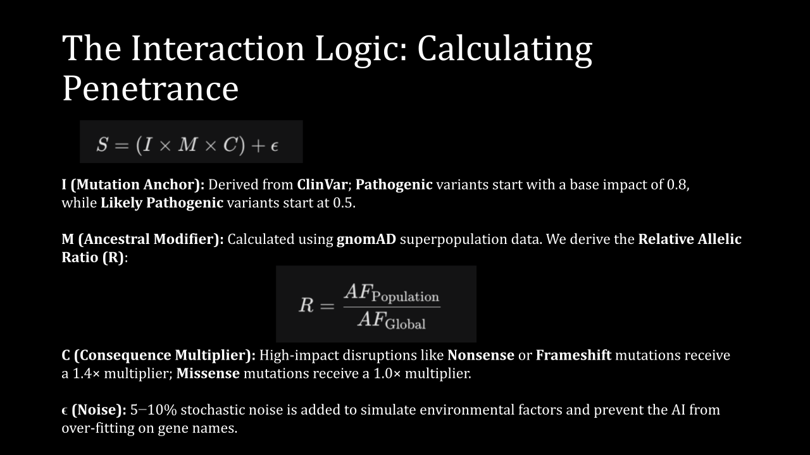
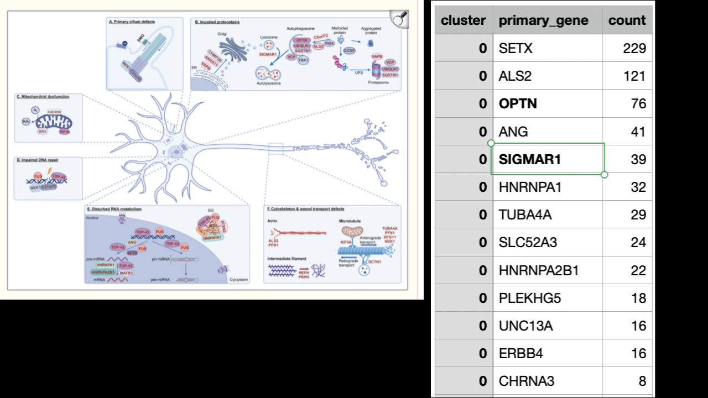

# RAIDers (Rare Disease & AI)

<p align="">
  
  


</p>


RAIDers is a federated computational framework designed to resolve the phenotypic heterogeneity of Amyotrophic Lateral Sclerosis (ALS) while maintaining data sovereignty. By synthesizing global genomic annotations with simulated patient cohorts, this framework establishes a scalable architecture for rare disease subtyping.


---

## Project Overview

Research in rare disease genomics is primarily hindered by extreme data scarcity and institutional data silos mandated by privacy regulations. While authoritative repositories provide critical intelligence on pathogenic variants, these resources are seldom integrated into a unified analytical space. Additionally, due to high variability and low expressivity there is a substantial hetereogenity in present in rare diseases. 

RAIDers addresses this fragmentation by consolidating disparate genomic signals into a high-fidelity feature matrix. This architecture serves as a "Genomic Flight Simulator," validating a federated subtyping pipeline on synthetic data to demonstrate readiness for integration with controlled-access biobank datasets.

##  Scientific Objectives

* **Subtype Discovery:** Identifying coherent molecular signatures across diverse ancestral backgrounds.
* **Feature Validity:** Confirming that integrated annotations contain sufficient signal to distinguish ALS-associated genes.
* **Federated Feasibility:** Demonstrating that analytical fidelity is maintained when data is physically separated across institutional nodes.
* **Ground Truth Validation:** Assessing whether discovered subtypes align with the simulated interaction rules.

## Workflow


---

## 1. Pipeline Execution

To initialize the pipeline from synthetic cohort generation through federated clustering:

```bash
# Clone the repository
git clone https://github.com/project/RAIDers.git
cd RAIDers

# Run the primary simulation and analysis (Filename TBD)
python main_pipeline.py

```

*Note: A curated version of `clinvar.cleaned.csv` must be present in the local directory for execution.*

---

## 2. Synthetic Cohort Generation

To overcome the "mathematical invisibility" of rare variants in standard population samples, RAIDers employs a digital mutagenesis strategy. This allows for the generation of a balanced, statistically significant cohort of 15,000 patients partitioned into five ancestral nodes.

### 2.1 Genomic Anchors: ClinVar

The pipeline utilizes `clinvar.cleaned.csv` to identify approximately 450 pathogenic ALS variants. These records provide the biological ground truth for the simulation, including:

* **Gene Association:** (e.g., *SOD1, TARDBP, C9orf72*)
* **Clinical Significance:** Standardized pathogenicity classifications.
* **Molecular Consequence:** Variant-level impact (missense, nonsense, frameshift).
  



### 2.2 The Interaction Model: gnomAD AF Integration

Rather than using static lookups, we simulate variable penetrance by treating the ancestral background as a clinical modifier. We utilize **gnomAD** as our Genomic Reference Frame. Specifically, we adopt gnomAD’s **superpopulation divisions** and **relative allelic ratios** to construct 'Ancestral Modifiers,' allowing us to simulate how different genomic backgrounds influence clinical expression. We then utilize **gnomAD Allele Frequency (AF)** logic to determine population-specific "tolerance" to pathogenic variants.

**Rationale for AF Estimation:**
Empirical gnomAD frequencies for rare ALS variants are often  or zero in specific subpopulations. Direct application would result in a sparse matrix with insufficient carrier counts for machine learning. We estimate and amplify these frequencies (targeting 0.01% – 0.2%) to ensure analytical viability while maintaining biological realism through Selection penalties (e.g., a 50% AF reduction for Loss-of-Function mutations).

### 2.3 Phenotype Severity Assignment Logic

Clinical labels (e.g., Fast vs. Slow Progression) are derived from the interaction between a variant’s baseline impact and its ancestral modifier (the AF Ratio).

```python
def assign_contextual_phenotype(variant_row, population_id):
    # 1. Mutation Impact (Anchor derived from ClinVar)
    base_impact = 0.8 if "Pathogenic" in variant_row['clinical_sig'] else 0.5
    
    # 2. Ancestral Modifier (gnomAD AF Ratio)
    # High AF ratio implies population tolerance (Protective Modifier)
    # Low AF ratio implies population sensitivity (Aggravating Modifier)
    af_ratio = variant_row[f'gnomAD_AF_{population_id}'] / variant_row['gnomAD_AF']
    modifier = 0.8 if af_ratio > 1.5 else (1.2 if af_ratio < 0.5 else 1.0)
    
    # 3. Probabilistic Interaction (with 5-10% stochastic noise)
    interaction_score = (base_impact * modifier) + np.random.normal(0, 0.05)
    
    return "Fast Progression" if interaction_score > 0.85 else "Slow Progression"

```
---

## 3. Federated Analysis: Subtype Discovery

The framework simulates five institutional silos partitioned by superpopulation (AFR, AMR, EAS, EUR, SAS).

### 3.1 Federated Learning Across Simulated Hospitals 

Molecular subtypes are discovered through a decentralized K-Means algorithm:

* **Local Iteration:** Clients compute cluster assignments and centroids based on local synthetic cohorts.
* **Global Aggregation:** Centroids are sent to a central server for federated averaging.
* **Broadcast:** Updated global centroids are returned to clients; the process repeats until convergence (change < 0.001).

### 3.2 Analytical Metrics

* **Computational Validation:** Evaluates the cohesion and separation of discovered molecular clusters using silhouette scores and within-cluster sum of squares.
<div style="display:flex; gap:10px;">


</div>


---


## 4. Future Directions

**Biological Validation**
  - Evaluate if patients with variants in genes associated with specific ALS subtypes are clustered together.

**Richer simulated patient data**
  - Extend the simulated cohort by incorporating additional biological/clinical features derived from prior work, such as:
    - Patient "background" genotypes around mutations
    - Phenotypic annotations (HPO)
    - Protein expression levels
    - Pathway or network-level features (Orphanet)
  - This would allow evaluation of how the models handle diverse biobank-style data modalities beyond the current setup.
 
**Learning paradigms**
  - **Unsupervised approaches** to identify latent structure and patient subgroups without predefined labels.
  - **Supervised or semi-supervised approaches** when labels (e.g., subtype labeling, patient outcome) are available
  - Determine which models best capture patient heterogeneity/disease subtype structure

**Evaluation on real biobank data**
  - As a longer-term direction, apply our pipeline to real-world biobank datasets to assess performance, scalability, and robustness in practical settings.

**Federated Learning**
  - Move from NVFlare with a central server to swarm learning (also on NVFlare) with no single owner, so multiple biobanks and rare disease cohorts across countries can train together even when no one can run a shared hub
  

## Data Sources

| Database | Purpose |
| :--: | :--: |
| [**ClinVar**](https://www.ncbi.nlm.nih.gov/clinvar/) | Pathogenic Variant Curation | 
| [**gnomAD**](https://gnomad.broadinstitute.org) | Gene & Variant Constraint Scores; Population AFs  | 
| [**OMIM**](https://www.omim.org) / [**Orphanet**](https://www.orpha.net)| Clinical gene-disease associations |

# Contributors 
|Name| Email | ORCID | Institution | 
| :--: | :--: | :--: | :--: |
| Aastha Shah | aasthashah.work@gmail.com | 0009-0008-7811-0177 | Queens University Belfast |
| Arnav Kharbanda | arnavkha@andrew.cmu.edu | 0009-0007-9195-9960 | Carnegie Mellon University | 
| Bill Paseman | bill@rarekidneycancer.org | 0000-0002-5020-0866 | |
| Chantera Lazard | lazard.c@northeastern.edu | 0009-0006-1367-3812 | Northeastern University | 
| Jialan Ma | jialanma7@gmail.com |0009-0007-2670-9076 | Broad Institute of MIT and Harvard |
| Kushal Koirala | kkoirala@unc.edu | 0009-0009-7935-4533 | University of North Carolina | 
| Kyulin Kim | lynn.kim.24@ucl.ac.uk | 0009-0007-8976-2405 | University College London | 
| Nikita Rajesh | | 0009-0009-9850-5261 | Carnegie Mellon University | 
| Pu (Paul) Kao | gaopuo1234@gmail.com | 0009-0003-9047-0160 | National Taiwan University |
| Shreya Nandakumar | | 0009-0006-9230-3659 | Carnegie Mellon University |
| Vibha Acharya | via16@pitt.edu | 0000-0001-6598-0052 | University of Pittsburgh |
| William Lu | wtlu@andrew.cmu.edu | 0000-0002-2768-1489 | Carnegie Mellon University |


